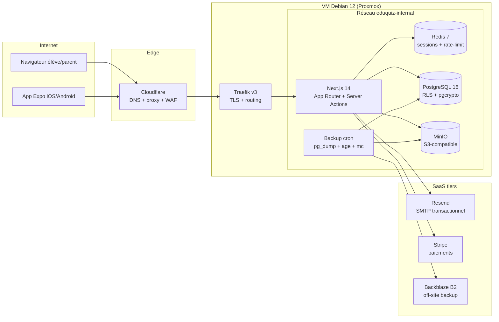
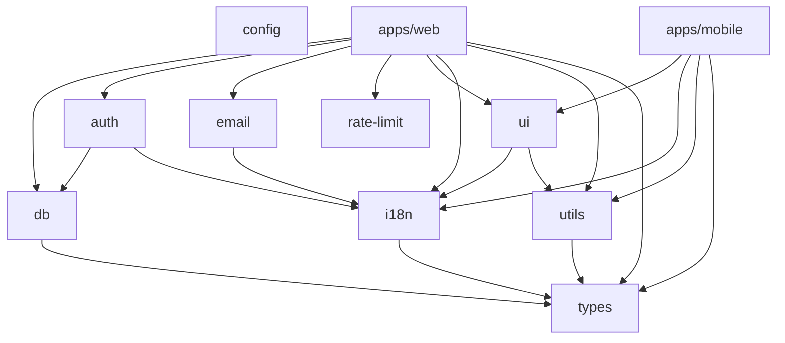
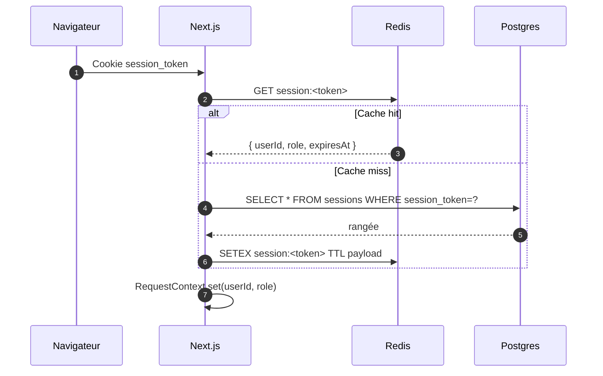
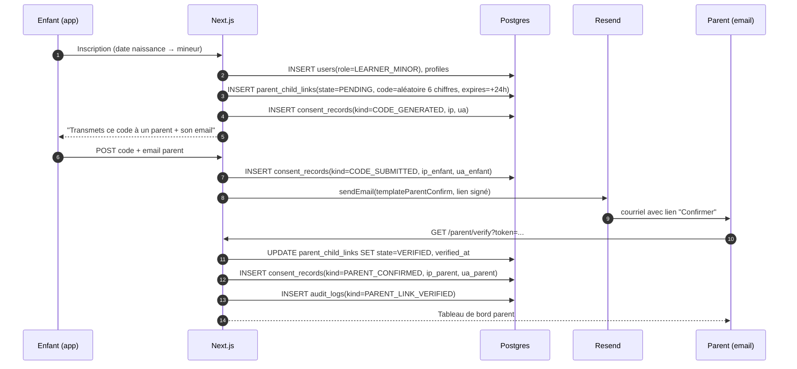

# Architecture technique — EduQuiz

Ce document décrit l'architecture applicative et opérationnelle de la V1 B2C
d'EduQuiz. Il est pensé comme _source unique de vérité_ : toute divergence entre
ce fichier et le code ou l'infrastructure doit se résoudre en mettant à jour le
document. Les détails d'hébergement matériel vivent dans
[`02-stack-proxmox.md`](./02-stack-proxmox.md) et
[`infrastructure/proxmox-setup.md`](./infrastructure/proxmox-setup.md) ; ce
document se concentre sur la logique applicative.

## Vue d'ensemble

EduQuiz est une plateforme web et mobile bilingue (FR/EN) servie depuis un
unique déploiement Docker Compose sur un hôte Proxmox. L'application web est une
Next.js 14 en App Router qui cumule front public, application authentifiée et
API interne (Server Actions + Route Handlers). Le mobile est un client Expo qui
consomme les mêmes endpoints. Le cœur de la persistance est PostgreSQL 16 avec
Row Level Security activée ; Redis sert de cache et de compteur de rate-limit ;
MinIO héberge les uploads.

La V1 privilégie **simplicité opérationnelle** sur élasticité : une seule
instance `web`, pas de file de messages, pas de worker asynchrone. Les tâches
planifiées (rotation de badges, rappels de série) sont exécutées par un
container `cron` léger ou directement par le container `web` via `setInterval`
dans un process dédié quand le volume le justifiera.

## Diagramme de composants



Seul le port `443/tcp` est exposé publiquement au travers de la box domestique.
Traefik termine TLS sur la VM, Cloudflare est configuré en mode **Full
(strict)** pour valider le certificat Let's Encrypt généré côté Traefik. Les
services internes (`postgres`, `redis`, `minio`) n'exposent aucun port vers
l'hôte en production : ils ne sont joignables que depuis le réseau Docker
`eduquiz-internal`.

## Topologie du monorepo

```
eduquiz/
├── apps/
│   ├── web/          Next.js 14 (App Router, output: standalone)
│   └── mobile/       Expo SDK 52 (Expo Router v4)
├── packages/
│   ├── ui/           Composants partagés (tailwind-variants + NativeWind)
│   ├── db/           Prisma + RLS + PrismaClient avec context
│   ├── auth/         Auth.js v5 backbone (config Edge/Node, providers,
│   │                 helpers password/tokens/permissions)
│   ├── email/        nodemailer + templates HTML bilingues (verification,
│   │                 welcome, reset-password)
│   ├── rate-limit/   Bucket fenêtre fixe Redis (ioredis), mode no-op si
│   │                 REDIS_URL absent, fail-open en cas de panne
│   ├── types/        Types de domaine (indépendants de Prisma)
│   ├── i18n/         Dictionnaires FR/EN + helpers (t, tf, tList)
│   ├── utils/        Fonctions pures (slug, age calc, scoring)
│   └── config/       ESLint, Prettier, TypeScript, Tailwind partagés
├── infra/
│   └── docker/       Dockerfile web + compose dev/prod + scripts backup
└── docs/             Documentation produit, technique, infrastructure
```

Le graphe de dépendances entre paquets reste acyclique et hiérarchique :



`config` n'est pas importé à l'exécution : il fournit uniquement les presets
`tsconfig`, `eslint`, `prettier`, `tailwind` consommés par les autres paquets.
`db` est le seul paquet qui parle à PostgreSQL ; aucune autre unité ne doit
importer `@prisma/client` ou ouvrir une connexion — on passe par le
`PrismaClient` contextualisé exposé par `@eduquiz/db`.

## Flux de requête type

Exemple : un élève soumet une tentative de quiz depuis le web.

```mermaid
sequenceDiagram
  autonumber
  participant B as Navigateur
  participant T as Traefik
  participant W as Next.js (server)
  participant R as Redis
  participant P as Postgres (RLS)

  B->>T: POST /quiz/<id>/submit (cookie session)
  T->>W: forward + HSTS + headers sécurité
  W->>R: GET session:<token>
  R-->>W: { userId, role, expires }
  W->>W: Zod.parse(payload)
  W->>R: INCR ratelimit:user:<id>:/quiz/submit (sliding 60s)
  W->>P: BEGIN; SET LOCAL app.current_user_id / app.current_role
  W->>P: INSERT attempts, attempt_answers
  W->>P: UPDATE progress (mastery EWMA)
  W->>P: COMMIT
  W-->>B: 200 { attemptId, score, passed, feedback }
```

Quelques invariants appliqués à **chaque** requête authentifiée :

1. La session est toujours lue depuis Redis en premier — c'est la source de
   vérité pendant la durée de vie du token. La table `sessions` en base sert de
   journal pour l'audit et la révocation.
2. Tout payload entrant traverse un schéma Zod (monorepo `@eduquiz/types`).
   L'erreur de validation déclenche une réponse `400` normalisée.
3. Avant toute lecture/écriture Prisma, l'application ouvre une transaction et
   exécute `SET LOCAL app.current_user_id` et `SET LOCAL app.current_role`. Les
   politiques RLS définies dans `packages/db/prisma/rls/` s'appuient sur ces
   variables. Si l'application oublie ce `SET`, les politiques par défaut
   **refusent** la requête — c'est la ceinture de sécurité.
4. Les mutations sensibles (consentement, changement de rôle, suppression) sont
   doublées d'un `INSERT` dans `audit_logs` dans la même transaction. Ce journal
   est append-only par trigger Postgres.

## Authentification et sessions

État livré en **Phase 1 (v0.1.0)** — Auth.js v5 (NextAuth) avec une architecture
en deux configs pour respecter la contrainte Edge runtime du middleware Next.js
:

- `@eduquiz/auth/config.ts` (Node) : adapter Prisma + provider Credentials
  (Argon2id) + providers Google et Apple OAuth conditionnels + events `signIn` /
  `signOut` qui logent dans `AuditLog`.
- `@eduquiz/auth/edge.ts` (Edge-safe) : callbacks JWT/session + autorisation des
  zones protégées, sans Prisma ni Argon2 (incompatibles avec Edge).

Trois moyens d'entrée :

**Email + mot de passe (Credentials).** Surface principale en V1. Mots de passe
hashés en Argon2id avec les paramètres OWASP 2024 (`m=19456 KiB`, `t=2`, `p=1`).
Re-hash automatique au login si les paramètres deviennent obsolètes. Refus de
connexion si email non vérifié, compte désactivé (`disabledAt`) ou supprimé
(`deletedAt`). Les échecs sont tracés dans `AuditLog.AUTH_FAILED` avec une
raison interne (`unknown_user` / `disabled` / `no_password` / `unverified` /
`bad_password`) jamais révélée à l'utilisateur (anti-énumération maintenue).

**OAuth Google / Apple.** Câblés via Auth.js, **conditionnels** : actifs
seulement si les variables `AUTH_GOOGLE_ID/SECRET` ou `AUTH_APPLE_ID/SECRET`
sont renseignées. Sinon les boutons OAuth sont absents des écrans de connexion /
inscription (pas de chemin mort vers une erreur). Lors d'un premier OAuth login,
l'adapter crée automatiquement la `User` + un `Account` lié.

**Magic link par courriel.** Préparé via les helpers `createToken` /
`consumeToken` (`@eduquiz/auth/tokens`) mais le provider Email d'Auth.js n'est
pas activé en V1. Cible Phase 2.

Côté session, la stratégie livrée est **JWT avec validation serveur par version
de session** :

- Auth.js Credentials utilise `session.strategy = "jwt"` pour rester compatible
  avec le provider Credentials et le middleware Edge.
- Le JWT contient les attributs utiles (`role`, `locale`, état du compte) et
  `User.sessionVersion`.
- Les helpers serveur Node relisent l'utilisateur en DB et comparent
  `session.user.sessionVersion` à `User.sessionVersion`. Si la version diffère,
  le JWT est considéré obsolète et l'utilisateur doit se reconnecter.
- Les opérations sensibles (reset password, changement de mot de passe,
  suppression de compte) incrémentent `User.sessionVersion`. La suppression des
  lignes `sessions` reste une défense en profondeur si une stratégie DB est
  réactivée plus tard.
- Le middleware Edge peut lire le JWT, mais ne peut pas garantir à lui seul une
  révocation instantanée contre la DB. Les Route Handlers, Server Actions et
  Server Components protégés doivent donc passer par les helpers serveur.

Cookies : `__Secure-eduquiz.session-token` en prod (`Secure`, `HttpOnly`,
`SameSite=Lax`).

**Flux livrés en Phase 1 :**

| Écran | Route                                                 | Contenu                                                                                     |
| ----- | ----------------------------------------------------- | ------------------------------------------------------------------------------------------- |
| 15    | `/[locale]/inscription`                               | Sélecteur de type (adulte actif, parent/mineur en « Bientôt disponible »)                   |
| 19    | `/[locale]/inscription/adulte`                        | Formulaire complet, validation Zod, OAuth conditionnels                                     |
| 22    | `/[locale]/verification-email`                        | Page d'attente avec bouton renvoi cooldown 60s                                              |
| 23    | `/[locale]/verification-email/confirme/[token]`       | Confirme l'email (succès / expiré / invalide)                                               |
| 16    | `/[locale]/connexion`                                 | Credentials + OAuth, bannières contextuelles `?verified` `?reset` `?session=expired`        |
| 17    | `/[locale]/mot-de-passe-oublie`                       | Demande lien reset, anti-énumération                                                        |
| 18    | `/[locale]/mot-de-passe-oublie/reinitialiser/[token]` | Nouveau mdp + confirmation, invalide les anciens JWT côté serveur via `sessionVersion`      |
| 29    | `/[locale]/profil`                                    | Vue lecture seule du profil                                                                 |
| 30    | `/[locale]/profil/modifier`                           | Édition profil (firstName, lastName, displayName, currentGrade, preferredLocale, avatarUrl) |
| 32    | `/[locale]/parametres/compte`                         | Changement mot de passe (changement email reporté)                                          |
| 33    | `/[locale]/parametres/langue`                         | Toggle FR/EN persisté                                                                       |
| 37    | `/[locale]/parametres/donnees`                        | Export Loi 25 via `/api/account/export` (JSON immédiat)                                     |
| 38    | `/[locale]/parametres/suppression`                    | Soft delete avec délai de grâce 30 jours                                                    |

**Sécurité Loi 25 livrée :**

- `ConsentRecord` créé en transaction à l'inscription (TERMS_ACCEPTED,
  PRIVACY_ACCEPTED, MARKETING_OPTED_IN si choisi)
- Toutes les actions sensibles tracées dans `AuditLog` (`AUTH_USER_CREATED`,
  `AUTH_VERIFY_EMAIL`, `AUTH_SIGNIN`, `AUTH_SIGNOUT`, `AUTH_FAILED`,
  `AUTH_PASSWORD_RESET`, `PROFILE_UPDATED`, `DATA_EXPORT_DELIVERED`,
  `DATA_DELETION_REQUESTED`)
- Soft delete : `disabledAt` empêche immédiatement le login, `DataRequest` tracé
  avec `graceExpiresAt` à +30j, purge effective différée à un worker cron à
  venir
- Anti-énumération sur connexion (message générique « identifiants invalides »)
  et sur reset password (toujours `ok:true` côté UI)
- Mot de passe actuel exigé pour : changement de mdp, suppression de compte
- Invalidation serveur des anciens JWT au reset password et au changement de mdp
  via `User.sessionVersion`

**Rate limiting Redis** (`@eduquiz/rate-limit`) — bucket fenêtre fixe via
`MULTI INCR + PEXPIRE NX`, mode no-op si `REDIS_URL` absent, fail-open en cas de
panne. Quotas livrés :

| Action                | Quota                  |
| --------------------- | ---------------------- |
| `signIn`              | 5 / minute / IP+email  |
| `register`            | 3 / 15 minutes / IP    |
| `forgot-password`     | 3 / 15 minutes / IP    |
| `resend-verification` | 3 / 15 minutes / email |
| `account-deletion`    | 3 / jour / userId      |

Sur dépassement : `{ ok: false, fieldErrors: { form: 'rateLimited' } }`, message
générique côté UI (l'anti-énumération reste préservée).

**Helper RLS** `withAuthenticatedDb()` (`apps/web/src/lib/auth/rls.ts`) combine
`requireApiUser()` + `withUser({ userId, role })` de `@eduquiz/db`. Pattern
documenté pour les Server Actions futures qui toucheront à des données partagées
(Lots 5+). En Phase 1, les actions opèrent sur le compte propre
(User/Profile/Account/Session) qui ne sont pas couverts par les politiques RLS —
un `prisma` direct suffit.

Diagramme historique de la stratégie session « database + cache » prévue pour
Phase 2 (Redis pour réduire le hit DB par requête) :



Le TTL Redis est aligné sur `expires` de la session Postgres (max 30 jours). En
cas de révocation (déconnexion, suppression de compte), on supprime la rangée
Postgres et la clé Redis dans la même transaction logique.

## Flux de consentement parental

Le cas mineur est le plus délicat ; il doit être reproduit à l'identique sur web
et mobile pour rester vérifiable au sens Loi 25.



Tant que `parent_child_links.state != 'VERIFIED'`, le mineur a accès à un sous-
ensemble **drastiquement réduit** de l'application : seule la page "en attente
de validation parentale" répond ; toute requête de contenu pédagogique est
rejetée par RLS (`app_is_verified_parent_of` retourne `false` dans les
politiques concernées).

## Frontières de sécurité

La défense en profondeur s'appuie sur plusieurs couches indépendantes — aucune
n'est supposée suffire seule.

**TLS et transport.** Cloudflare termine un premier TLS côté edge, Traefik
termine le second côté VM. Les échanges internes entre containers restent sur le
réseau Docker `eduquiz-internal` non routé. HSTS (`max-age=31536000; preload`),
`X-Frame-Options: DENY`, `Referrer-Policy: strict-origin-when-cross-origin`,
`Content-Type-Options: nosniff` sont posés par Traefik pour toutes les réponses.

**Auth.** Argon2id pour les mots de passe, cookies
`HttpOnly Secure SameSite=Lax`, rotation de session à chaque changement de rôle,
invalidation serveur à la déconnexion. Rate-limit Redis sur les surfaces d'auth
(`/api/auth/*`) : 5 échecs par IP et par minute → cooldown exponentiel.

**Autorisation.** Deux couches :

1. Route-level : middleware Next.js `requireRole(['PARENT', 'ADMIN'])` sur
   chaque Route Handler et Server Action.
2. Data-level : RLS Postgres. Les politiques sont définies dans
   `packages/db/prisma/rls/*.sql` et s'appuient sur `app_current_user_id()`,
   `app_current_role()`, `app_is_verified_parent_of(child)`. Oublier le
   `SET LOCAL` côté application = requête refusée (fail-closed).

**Input.** Tous les endpoints valident leur payload via Zod (`@eduquiz/types`).
Les identifiants sont des UUID v7 parsés avant toute requête SQL. L'upload
d'avatar est plafonné (2 Mo, extensions whitelistées, signature magique
vérifiée).

**Secrets.** Jamais en dépôt. `.env.prod` vit sur la VM, hors Git. Les secrets
de build CI sont dans GitHub Secrets. La clé privée `age` qui déchiffre les
dumps n'est jamais sur le serveur — elle vit chez Paul, dans un gestionnaire de
mots de passe, avec une copie physique chiffrée hors ligne.

**Contenu.** Les leçons publiées sont versionnées dans `content_versions`. Les
tentatives d'apprenants référencent un `activityVersion` pour garantir que la
correction se fait sur la version vue — pas de dérive si un auteur modifie
l'énoncé entre-temps.

**Audit.** `audit_logs` et `consent_records` sont append-only (triggers PL/pgSQL
bloquent `UPDATE` et `DELETE`). Conservation minimale 7 ans pour
`consent_records` (exigence Loi 25). L'export Loi 25 de l'utilisateur inclut ces
journaux filtrés sur son UUID.

## Cadre d'internationalisation (i18n)

Deux langues, **FR par défaut**. Le français est la langue de référence
éditoriale (les contenus sont rédigés en FR puis traduits en EN, pas l'inverse).

Côté code, deux niveaux :

1. **Interface** : dictionnaires plats `namespace.cle` dans `packages/i18n/` —
   un fichier par locale, stockés au format JSON. Le helper `t(key, vars)` fait
   un lookup direct et retourne la clé non résolue en cas d'absence (aide à
   détecter les trous de traduction au développement).
2. **Contenus pédagogiques** : champs parallèles `xxxFr` / `xxxEn` dans Prisma
   (`title_fr`, `title_en`, `body_fr`, `body_en`, etc.). La locale effective
   d'affichage est calculée dans l'ordre : préférence utilisateur → header
   `Accept-Language` → cookie `NEXT_LOCALE` → défaut `FR`.

Les dates, heures et nombres passent systématiquement par `Intl.DateTimeFormat`
et `Intl.NumberFormat` avec la locale résolue. La timezone serveur d'EduQuiz est
`America/Toronto` ; les streaks quotidiens utilisent la date locale Montréal
(`Europe/Montréal`... non, on reste sur `America/Toronto` côté applicatif, c'est
équivalent pour le Québec et déjà câblé dans le container `backup`).

## Journalisation et observabilité (V1)

La V1 s'en tient au strict minimum : les logs structurés des containers vers
`stderr`, captés par Docker. `docker compose logs --tail 200 web` reste la
commande de triage. Un endpoint `/api/health` retourne `{"status":"ok"}` si la
base répond dans les 2 secondes — c'est la sonde Traefik et la future cible
d'Uptime Kuma. Pas de Prometheus, Grafana ou Loki en V1 : ce lot est planifié
(cf. [`08-delivery-phases.md`](./08-delivery-phases.md)).

## Variables d'environnement

La liste canonique des variables requises vit dans
[`.env.example`](../.env.example) (dev) et
[`.env.prod.example`](../.env.prod.example) (prod). Chaque nouvelle variable
introduite dans le code doit être ajoutée aux deux fichiers dans la même PR
(checklist de revue). Le document [`02-stack-proxmox.md`](./02-stack-proxmox.md)
§"Variables" détaille la signification métier de chacune.

## Changements majeurs prévus

Les évolutions architecturales actées mais reportées après la V1 :

- PgBouncer devant Postgres pour pooler les connexions Prisma en mode
  transaction quand le nombre de sessions concurrentes dépassera ~50.
- Worker asynchrone (BullMQ sur Redis) pour les envois d'emails volumineux
  (rapports hebdomadaires parents) et les exports Loi 25.
- Réplica Postgres en lecture pour servir les requêtes analytiques parentales
  lorsque le volume le justifiera.
- Stack d'observabilité (Prometheus + Loki + Grafana + Uptime Kuma + alerting).
- Déchiffrement LUKS automatisé via TPM (arbitrage sécurité vs. MTTR).

Aucun de ces chantiers ne bloque la mise en ligne ; ils sont documentés pour que
les choix initiaux restent cohérents avec la trajectoire prévue.

## Références

- Stack et hébergement : [`02-stack-proxmox.md`](./02-stack-proxmox.md)
- Modèle de données : [`03-data-model.md`](./03-data-model.md)
- Sécurité et conformité : [`04-security-loi25.md`](./04-security-loi25.md)
- Déploiement opérationnel :
  [`infrastructure/proxmox-setup.md`](./infrastructure/proxmox-setup.md)
- Sauvegardes et reprise :
  [`infrastructure/backup-strategy.md`](./infrastructure/backup-strategy.md)
- Schéma Prisma :
  [`packages/db/prisma/schema.prisma`](../packages/db/prisma/schema.prisma)
- Politiques RLS : [`packages/db/prisma/rls/`](../packages/db/prisma/rls/)
