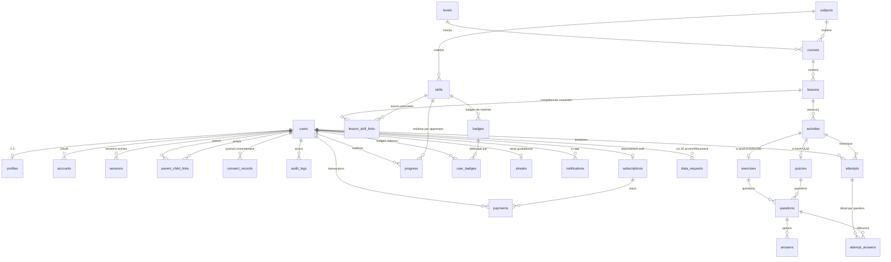

# Modèle de données — EduQuiz

Ce document décrit les entités persistées dans PostgreSQL 16 et les décisions de
conception associées. Le schéma faisant foi est
[`packages/db/prisma/schema.prisma`](../packages/db/prisma/schema.prisma) ; en
cas de divergence, c'est le schéma qui gagne, et ce document doit être mis à
jour dans la même PR que le changement de schéma.

## Entités couvertes en V1

Regroupées par domaine fonctionnel :

1. **Identité** : `users`, `profiles`, `accounts`, `sessions`,
   `verification_tokens`.
2. **Rattachement et consentement** : `parent_child_links`, `consent_records`.
3. **Audit et conformité Loi 25** : `audit_logs`, `incident_registers`,
   `data_requests`.
4. **Abonnement et paiement** : `subscriptions`, `payments`.
5. **Taxonomie pédagogique** : `levels`, `subjects`, `skills`, `courses`,
   `lessons`, `lesson_skill_links`.
6. **Activités pédagogiques** : `activities`, `exercises`, `quizzes`,
   `questions`, `answers`.
7. **Production apprenant** : `attempts`, `attempt_answers`, `progress`.
8. **Gamification** : `badges`, `user_badges`, `streaks`.
9. **Communication** : `notifications`.
10. **Versionnage de contenu** : `content_versions`.

## Diagramme entité-relation



Les tables `verification_tokens`, `incident_registers`, `data_requests`,
`notifications` et `content_versions` n'apparaissent pas dans le diagramme pour
le garder lisible ; leurs relations sont triviales (référence par UUID). Le
schéma Prisma reste la référence exhaustive.

## Choix de conception

**UUID v7 pour toutes les clés primaires.** V7 ajoute un préfixe temporel
monotone aux 128 bits de l'UUID, ce qui donne un ordre chronologique _naturel_
sans exposer les volumes (contrairement aux serials) et conserve de bonnes
propriétés d'insertion en B-tree (éviter les pages-split aléatoires de l'UUID
v4). Les IDs restent des strings applicatifs opaques.

**Citext pour les emails.** Les égalités sont insensibles à la casse sans
duplication applicative (`WHERE email = ?` trouve `Paul@x.com` avec
`paul@x.com`). L'extension est activée par la migration d'init et déclarée dans
le datasource Prisma.

**pgcrypto pour les champs vraiment sensibles.** La date de naissance dans
`profiles.birth_date` peut être chiffrée au repos via `pgp_sym_encrypt` ; la clé
vit en dehors de la base. En V1, on stocke en clair mais la colonne reste
taillée pour accueillir le chiffrement sans migration destructrice plus tard.

**Append-only par trigger PL/pgSQL sur `audit_logs` et `consent_records`.** Un
`BEFORE UPDATE OR DELETE ... RAISE EXCEPTION` bloque toute modification. Les
corrections éventuelles (régime incident Loi 25) passent par un `INSERT`
correctif référencé dans `payload.corrections`. Ce parti pris trace qui a tenté
de modifier quoi et quand, à l'encontre d'une suppression silencieuse.

**Bilinguisme par colonnes jumelles.** Plutôt qu'une table de traduction
pivotée, on duplique `title_fr`/`title_en`, `body_fr`/`body_en`, etc. C'est plus
verbeux mais les requêtes restent triviales, les index multilingues performants,
et l'écriture manuelle est plus sûre que de se reposer sur un trigger qui
choisit la langue.

**Polymorphisme contrôlé sur `activities`.** Une `Activity` a un `kind` in
(`EXERCISE`, `QUIZ`) et deux relations 1-1 mutuellement exclusives (`exercise`,
`quiz`). La contrainte d'exclusion est vérifiée par un `CHECK` PostgreSQL
(`exercise_id IS NOT NULL XOR quiz_id IS NOT NULL` sur les questions). Prisma ne
modélise pas les CHECKs structurels ; ils vivent dans la migration SQL.

**Versionnage via `content_versions` + `published_version` sur la table
source.** Chaque publication insère un snapshot complet dans `content_versions`
(`versionableKind`, `versionableId`, `version`, `snapshot`) et met à jour le
pointeur `published_version` sur la table source. Les tentatives référencent
`activity_version` pour garantir une correction stable (l'énoncé vu est l'énoncé
corrigé).

**Monnaie en cents entiers.** `payments.amount_cents` est un `Int` en CAD. Pas
de `Numeric` pour éviter les conversions de précision — on convertit à
l'affichage.

## Row Level Security

Toutes les tables qui contiennent des données utilisateur appliquent RLS. La
stratégie est **fail-closed** : si les variables de session ne sont pas
positionnées, les politiques par défaut refusent toute lecture. L'application
doit ouvrir une transaction et y poser trois variables :

```sql
SET LOCAL app.current_user_id    = '<uuid utilisateur>';
SET LOCAL app.current_role       = '<LEARNER_ADULT|LEARNER_MINOR|PARENT|ADMIN>';
SET LOCAL app.current_request_id = '<corrélation>'; -- optionnel
```

Côté code, `packages/db/src/client.ts` expose un helper
`withUserContext(userId, role, fn)` qui ouvre une `prisma.$transaction`, exécute
les trois `SET LOCAL` via `$executeRaw`, puis appelle `fn(tx)` avec la
transaction typée. Le helper restaure l'état en fin de transaction (implicite
avec `SET LOCAL`).

Quatre fonctions PL/pgSQL (dans `packages/db/prisma/rls/00_helpers.sql`)
encapsulent la lecture des variables et sont utilisées par les politiques :

- `app_current_user_id()` — UUID ou NULL si non défini.
- `app_current_role()` — rôle textuel ou NULL.
- `app_is_admin()` — shortcut `app_current_role() = 'ADMIN'`.
- `app_is_verified_parent_of(child uuid)` — existe-t-il un `parent_child_links`
  avec `parent_id = app_current_user_id()`, `child_id = child`,
  `state = 'VERIFIED'`.

### Exemples de politiques

**`profiles` — un utilisateur lit/édite son profil ; un parent vérifié lit le
profil de son enfant ; admin voit tout.**

```sql
ALTER TABLE profiles ENABLE ROW LEVEL SECURITY;

CREATE POLICY profiles_select_self ON profiles FOR SELECT
  USING (
    user_id = app_current_user_id()
    OR app_is_verified_parent_of(user_id)
    OR app_is_admin()
  );

CREATE POLICY profiles_update_self ON profiles FOR UPDATE
  USING (user_id = app_current_user_id() OR app_is_admin())
  WITH CHECK (user_id = app_current_user_id() OR app_is_admin());
```

**`attempts` — un apprenant ne voit que ses tentatives ; un parent vérifié voit
celles de ses enfants ; admin voit tout.**

```sql
ALTER TABLE attempts ENABLE ROW LEVEL SECURITY;

CREATE POLICY attempts_select ON attempts FOR SELECT
  USING (
    user_id = app_current_user_id()
    OR app_is_verified_parent_of(user_id)
    OR app_is_admin()
  );

CREATE POLICY attempts_insert_self ON attempts FOR INSERT
  WITH CHECK (user_id = app_current_user_id());
```

**`consent_records` — lecture pour l'intéressé, le parent vérifié et l'admin ;
insertion ouverte à l'application ; UPDATE/DELETE bloqués par trigger.**

```sql
ALTER TABLE consent_records ENABLE ROW LEVEL SECURITY;

CREATE POLICY consent_select ON consent_records FOR SELECT
  USING (
    user_id = app_current_user_id()
    OR subject_user_id = app_current_user_id()
    OR app_is_verified_parent_of(coalesce(subject_user_id, user_id))
    OR app_is_admin()
  );

CREATE POLICY consent_insert ON consent_records FOR INSERT
  WITH CHECK (app_current_user_id() IS NOT NULL);
```

Les autres politiques suivent le même patron : un jeu de règles pour l'acteur,
un pour l'admin, un pour le parent vérifié quand l'entité concerne un enfant. Le
détail exhaustif vit dans `packages/db/prisma/rls/*.sql` (huit fichiers par
domaine).

### Pourquoi RLS plutôt qu'un uniquement filtrage applicatif ?

Parce que c'est une défense en profondeur, pas un remplacement. Un bug de
contrôleur qui oublie un `WHERE userId = ?` ne fuit pas les données d'un autre
utilisateur : la base refuse. Le coût additionnel (quelques millisecondes par
requête, complexité des politiques) est négligeable devant le coût d'une fuite à
cause d'une requête mal contrôlée — surtout pour une plateforme qui manipule des
données de mineurs.

## Extensions Postgres requises

Déclarées dans le datasource Prisma et créées au premier démarrage par
`infra/docker/init/01-extensions.sql` :

- `pgcrypto` — `gen_random_uuid()`, primitives de chiffrement.
- `citext` — type insensible à la casse (emails).

Pour un volume neuf, le script d'init les crée automatiquement ; pour un volume
restauré depuis un dump B2, il faut les recréer à la main (cf.
[`infrastructure/backup-strategy.md`](./infrastructure/backup-strategy.md),
section Restauration).

## Migrations et compatibilité

Les migrations Prisma sont **toujours rétrocompatibles** — règle absolue. Le
patron en trois phases :

1. **Ajout** : nouvelle colonne nullable, nouvelle table, nouvel index
   concurrent. Le code continue de lire l'ancienne forme et commence à écrire la
   nouvelle si pertinent.
2. **Backfill + lecture hybride** : script de remplissage des nouvelles colonnes
   ; le code lit les deux variantes (nouvelle en priorité, fallback ancienne).
3. **Suppression** : une fois l'ancienne forme inutilisée, on retire la colonne
   ou la contrainte.

Ce découpage permet un rollback sûr à n'importe quelle étape. Le template PR
(`.github/pull_request_template.md`) a une checkbox dédiée qui rappelle la
règle. Le workflow `.github/workflows/migrations-check.yml` vérifie que le
schéma Prisma correspond exactement à l'état résultant des migrations
(`prisma migrate diff --from-url --to-schema-datamodel --script` doit être
vide).

## Types TypeScript

Deux sources de types différentes, ne pas les confondre :

- **Types de domaine** — dans `packages/types/`. Indépendants de Prisma.
  Définissent les DTOs d'API, les payloads Zod, les enums partagés front/back.
  C'est ce que `apps/web` et `apps/mobile` importent.
- **Types Prisma** — générés dans `packages/db/src/generated/client/`. Exposés
  uniquement via les fonctions de `packages/db/src/*.ts`. Pas de
  `import { User } from '@eduquiz/db/prisma'` dans les apps : on passe par
  `getUserById(id): Promise<UserDTO>`.

Cette séparation limite le couplage : un refactor de schéma n'oblige pas à
toucher à 40 fichiers côté front.

## Volumes estimés V1

Ordre de grandeur pour un déploiement initial (1 000 utilisateurs, 50 000
tentatives/mois) :

| Table              | Rangées attendues / an | Taille estimée |
| ------------------ | ---------------------- | -------------- |
| `users`            | ~5 000                 | < 5 Mo         |
| `profiles`         | ~5 000                 | < 5 Mo         |
| `attempts`         | ~600 000               | ~300 Mo        |
| `attempt_answers`  | ~6 000 000             | ~2 Go          |
| `audit_logs`       | ~1 500 000             | ~500 Mo        |
| `consent_records`  | ~30 000                | ~30 Mo         |
| `content_versions` | ~5 000                 | ~200 Mo        |

À ces volumes, `pg_dump --format=custom --compress=9` produit un fichier de
l'ordre de 400 Mo, compatible avec la stratégie de sauvegarde quotidienne
courante (cf. [backup-strategy.md](./infrastructure/backup-strategy.md)). Au-
delà de 50 Go compressés, on bascule sur pgBackRest avec WAL archiving.

## Références

- Schéma Prisma :
  [`packages/db/prisma/schema.prisma`](../packages/db/prisma/schema.prisma)
- Migrations :
  [`packages/db/prisma/migrations/`](../packages/db/prisma/migrations/)
- Politiques RLS : [`packages/db/prisma/rls/`](../packages/db/prisma/rls/)
- Helpers RLS :
  [`packages/db/prisma/rls/00_helpers.sql`](../packages/db/prisma/rls/00_helpers.sql)
- Client contextualisé :
  [`packages/db/src/client.ts`](../packages/db/src/client.ts)
- Architecture : [`01-architecture.md`](./01-architecture.md)
- Sécurité et Loi 25 : [`04-security-loi25.md`](./04-security-loi25.md)
